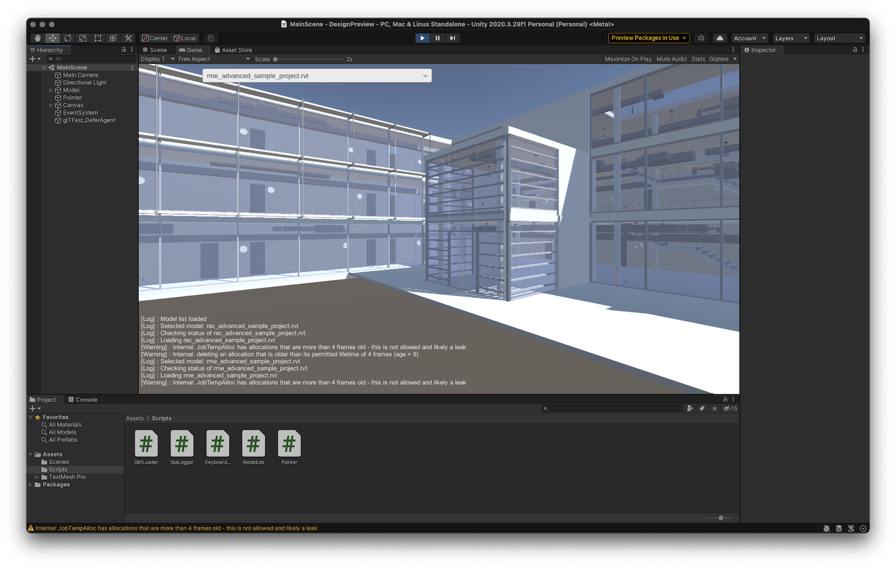

# forge-unity-poc

Prototype application allowing you to load and preview your [Autodesk Forge](https://forge.autodesk.com) models in Unity.

The sample code consists of two projects:

- Simple Node.js server used to list 3D models in a pre-configured Forge bucket, and convert the models
into the glb format with [meshopt](https://github.com/zeux/meshoptimizer/blob/master/gltf/README.md) compression.
To enable picking, the conversion process also embeds 32-bit object IDs in the color channel of the output geometry.

- Unity application that communicates with the Node.js server, and uses [glTFast](https://github.com/atteneder/glTFast)
to load and preview the generated glb files. It includes a "pointer" game object that can identify whatever object
it is pointing at by parsing the object ID from the color channel.
